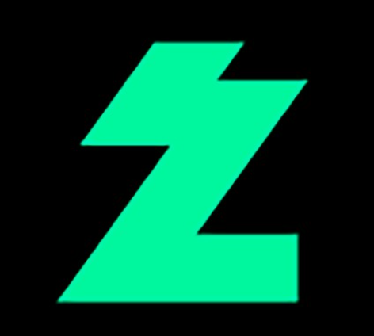
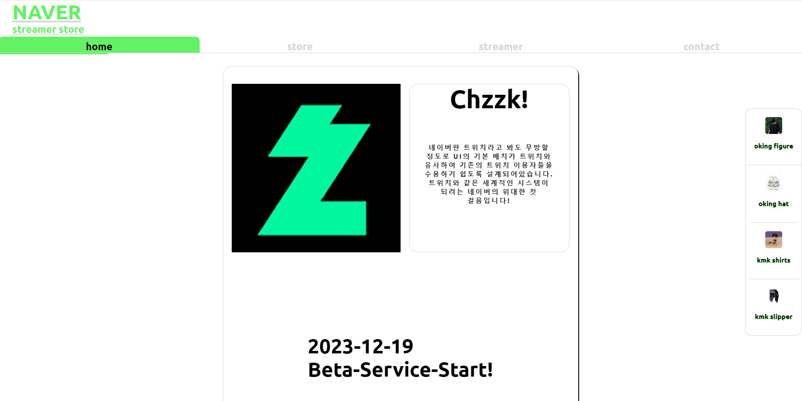
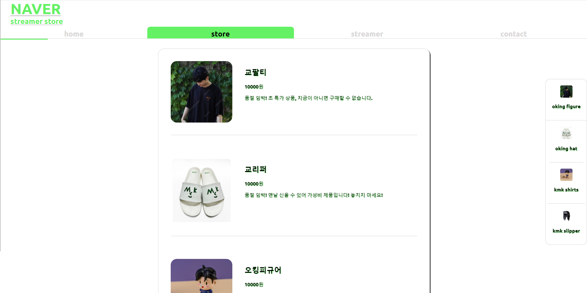
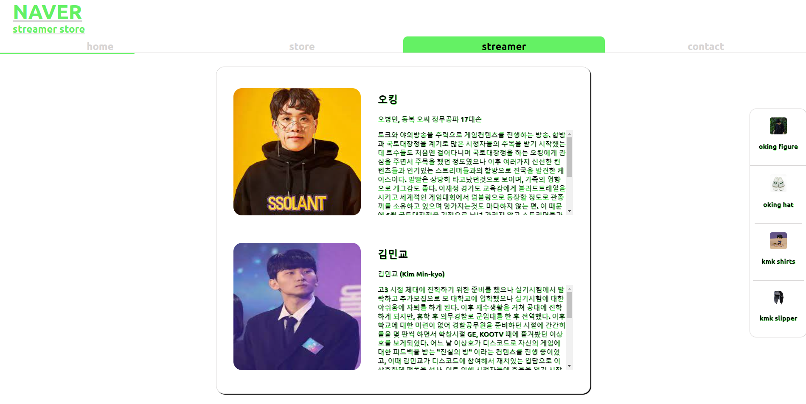
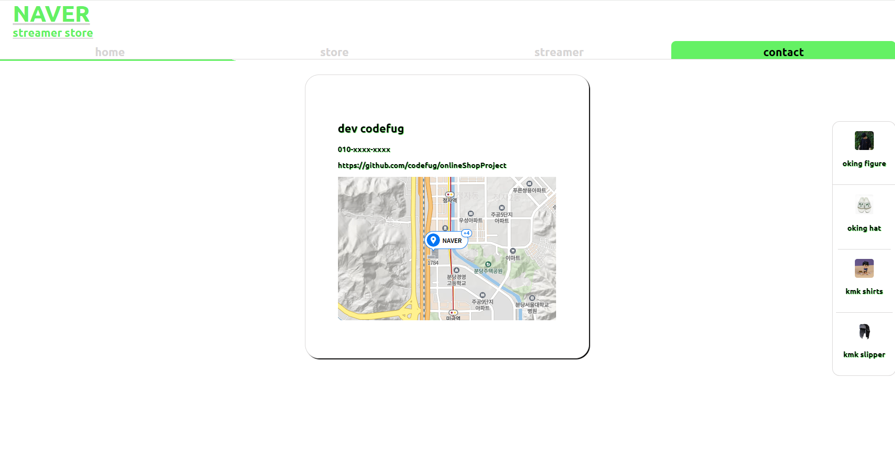

<!-- PROJECT LOGO -->
 

  

<h3 align="center">onlineShopProject</h3>

  

  Simple Online store toy project Using Vanila JS.
  First Webpack Experience

<!-- TABLE OF CONTENTS -->

  
Table of Contents

  <ol>
    <li>
      <a href="#about-the-project">About The Project</a>
      <ul>
        <li><a href="#built-with">Built With</a></li>
      </ul>
    </li>
    <li><a href="#contact">Contact</a></li>
    <li><a href="#acknowledgments">Acknowledgments</a></li>
  </ol>

<!-- ABOUT THE PROJECT -->
## About The Project

![Product Name Screen Shot][product-screenshot1]
window.onload event를 이용한 loading 화면

페이지의 홈, 치지직을 기념하여 로고, 설명, 오픈 날짜를 게시하였다.

스트리머의 아이템을 소개하는 페이지

스트리머 자체를 소개하는 페이지

네이버 본사에 대한 정보, 개발자 (나) 에 대한 정보를 나타내는 페이지

(<a href="#readme-top">back to top</a>)

### Built With

* ![JavaScript][JavaScript.url]
* ![HTML5][HTML5.url]
* ![CSS3][CSS3.url]
* ![Webpack][Webpack.url]
* ![NPM][npm.url]

(<a href="#readme-top">back to top</a>)

<!-- CONTACT -->
## Contact

codefug

Project Link: [https://github.com/codefug/onlineShopProject](https://github.com/codefug/onlineShopProject)

(<a href="#readme-top">back to top</a>)

<!-- ACKNOWLEDGMENTS -->
## Acknowledgments
<ol>
    <li>웹팩 환경 설정시 배운 지식</li>
    <ul>
        <li>공식문서를 활용하여 webbundle이 무엇인지, 이를 통해서 할 수 있는 것은 무엇인지를 배웠다. (webpack에서는 dependency map을 생성하여 entry파일부터 각 파일을 추적한다.)</li>
        <li>HtmlWebpackPlugin을 이용하여 dist폴더에 내 template에 기반한 HTML파일을 넣을 수 있게 하였다.</li>
        <li>prod.config, deb.config를 merge라는 함수를 사용하여 따로 setting할 수 있게 하였다.</li>
        <li>css, font, img loader를 활용하여 dist폴더에 고유의 path를 가진 각 파일들을 생성할 수 있게 하였다.</li>
        <li>dev에는 inline-source map을 통해서 index.js안의 각 파일중 어떤 파일에 오류가 났는지 확인할 수 있게 했다.</li>
    </ul>
     
    <li>JS functional programming</li>
    <ul>
        <li>프로젝트는 전역 변수를 최소화하는 것을 목적으로 진행하였다.</li>
        <li>전체 구성은 다음과 같다.</li>
        <ol>
          <li>loading</li>
          <ul>
            <li>window의 load event에 setTimeout을 이용하여 4초 시간을 준 후 없어지게끔 만들었다.</li>
          </ul>
          <li>additem</li>
          <ul>
            <li>contact, store, stremer 각 type에 따라서 item을 형성해주는 함수</li>
            <li>type에 따라 class를 다르게 형성하여 css로 customazation할 수 있게 하였다.</li>
            <li>item은 객체를 형성하는 함수가 존재하고 이 객체의 property를 채우는 함수가 존재한다.</li>
          </ul>
          <li>tabaction</li>
          <ul>
            <li>각 tab에 맞는 function을 zip화 시킨 후에 tab의 click event가 일어나면 event를 받아서 event에 맞는 function을 filter를 이용해 꺼낸다.</li>
            <li>selected된 tab을 css로 customaze하기 위해서 class 자체를 없앤 후 tab을 foreach로 각 tab에 넣은 후 지정된 tab만 selected를 지정한다.</li>
          </ul>
        </ol>
</ol>

(<a href="#readme-top">back to top</a>)

<!-- MARKDOWN LINKS & IMAGES -->
<!-- https://www.markdownguide.org/basic-syntax/#reference-style-links -->
[product-screenshot1]: ./src/screenshotForReadMe/LoadingPage.png
[JavaScript.url]: https://img.shields.io/badge/javascript-%23323330.svg?style=for-the-badge&logo=javascript&logoColor=%23F7DF1E
[HTML5.url]: https://img.shields.io/badge/html5-%23E34F26.svg?style=for-the-badge&logo=html5&logoColor=white
[CSS3.url]: https://img.shields.io/badge/css3-%231572B6.svg?style=for-the-badge&logo=css3&logoColor=white
[Webpack.url]: https://img.shields.io/badge/webpack-%238DD6F9.svg?style=for-the-badge&logo=webpack&logoColor=black
[npm.url]: https://img.shields.io/badge/NPM-%23CB3837.svg?style=for-the-badge&logo=npm&logoColor=white